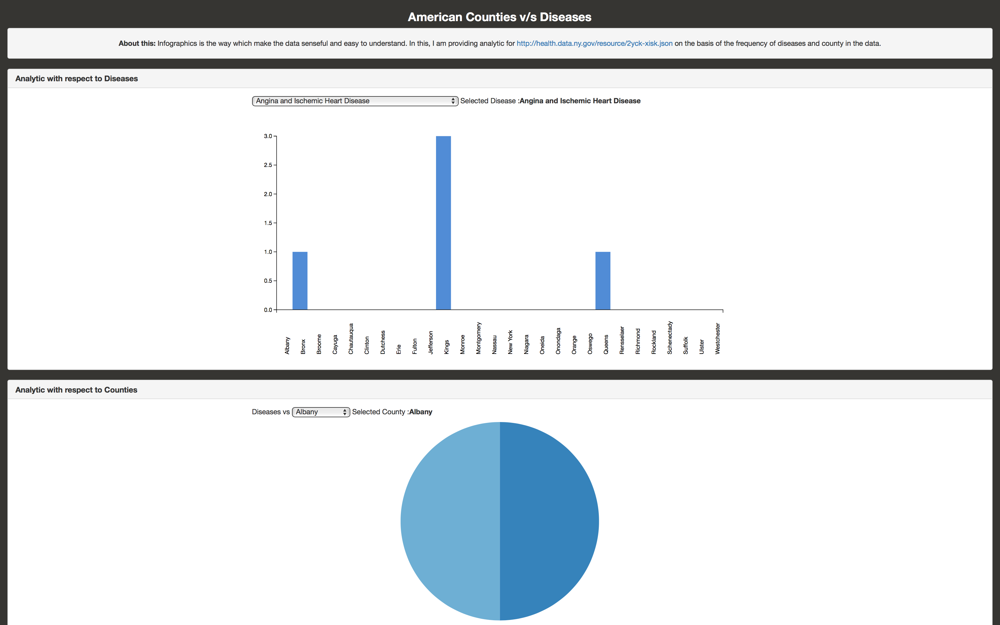
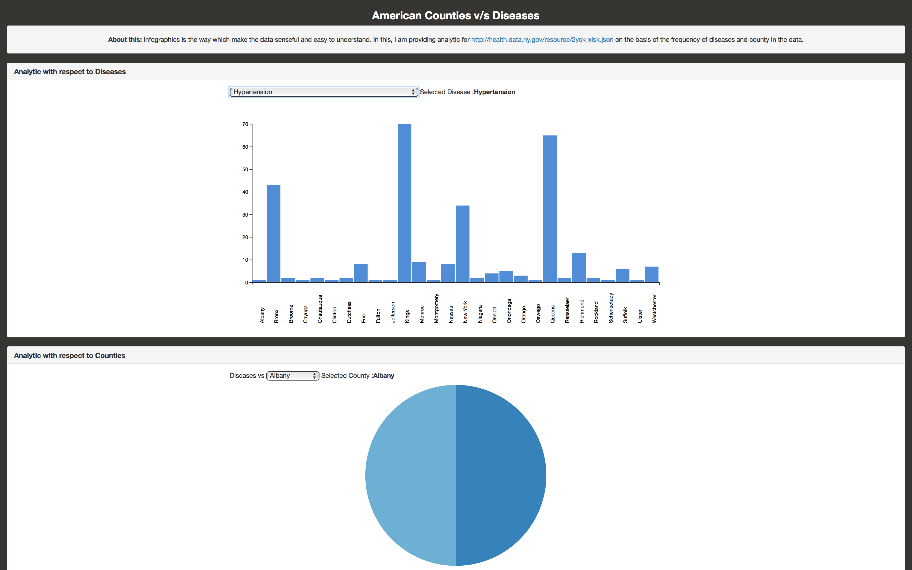
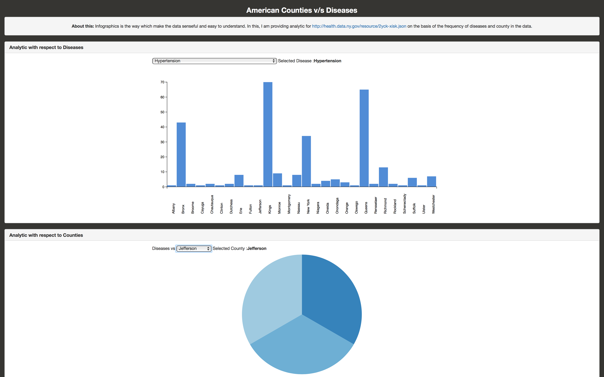
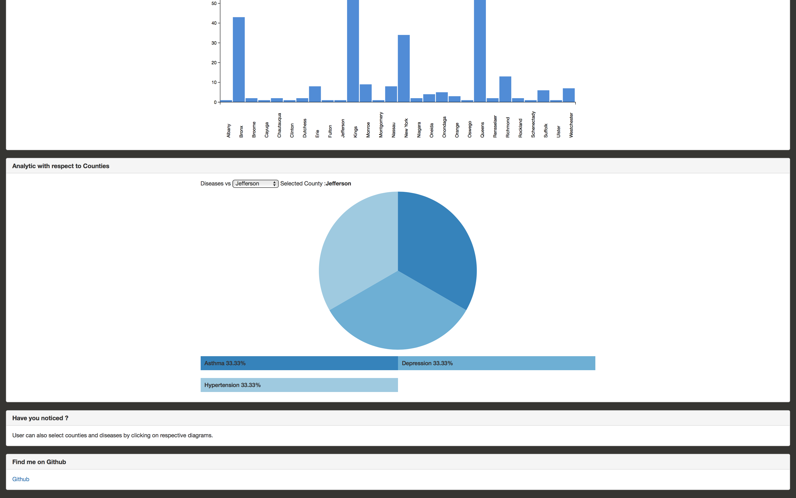
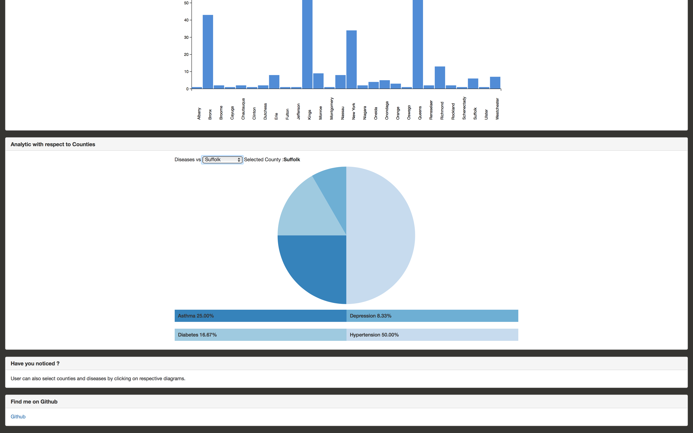

### Open Health
***
**Overview**:
Health information technology (HIT) is information technology applied to health care. It provides the umbrella framework to describe the comprehensive management of health information across computerized systems and its secure exchange between consumers, providers, government and quality entities, and insurers. Health information technology (HIT) is in general increasingly viewed as the most promising tool for improving the overall quality, safety and efficiency of the health delivery system.
 - Improve health care quality or effectiveness.
 - Increase health care productivity or efficiency.
 - Prevent medical errors and increase health care accuracy and procedural correctness.
 - Reduce health care costs.
 - Increase administrative efficiencies and health-care work processes.
 - Decrease paperwork and unproductive or idle work time.
 - Extend real-time communications of health informatics among health care professionals.
 - Expand access to affordable care.

### Screenshots
***

### Features
***
- Info-graphics is the way which make the data sensible and easy to understand.
- Analytic with respect to Diseases
- Analytic with respect to Counties
- Simple data representation in Bar charts and Pie Charts.
- Cross referencing in user interface.

### Technology Stack
***
HTML CSS3 Bootstrap D3 JS Angular JS Ubuntu GIMP

### Learning & Experience
***
Informatics projects require a good knowledge of info-graphics and data analytics skill.
- Learned about info-graphics and data analytics methods..
- Open health data and it's uses.
- Learned D3.Js
